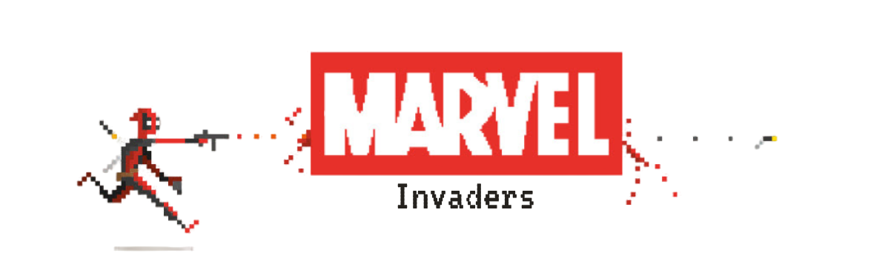
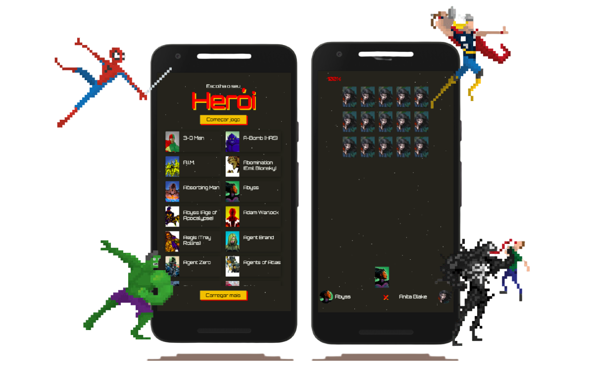

# Marvel Invaders
<h3 align="center">
    
    <br>
</h3>

## Índice

* [Informacoes Gerais](#informacoes-gerais)
* [Tecnologias](#tecnologias)
* [Setup](#setup)
* [Regras do Jogo](#regras-do-jogo)

# Informações Gerais
Marvel Invaders é um jogo inspirado no clássico Space Invaders e faz parte do trabalho final do Processo Seletivo Interno da EJCM para Tech Lead. Esse jogo foi desenvolvido usando Javascript puro, CSS e HTML. O aplicativo possui uma tela principal, que é o arquivo ```index.html```. Nesse arquivo, é feito o display de personagens da Marvel através de uma conexão com a [API da Marvel](developer.marvel.com/). O usuário, então, deve escolher o personagem da Marvel que deseja jogar e iniciar o jogo. Ao clicar no botão de "Começar jogo", o usuário é redirecionado para o arquivo do jogo, o ```game.html```, e o jogo enfim começa. <br />Observação: O jogo foi desenvolvido como uma tela de aplicativo, então, para garantir a melhor experiência, ao abrir o projeto é importante colocar as dimensões da tela como um aplicativo. 

<h3 align="center">
    
    <br>
</h3>

# Tecnologias
* Javascript
* CSS
* HTML

# Setup
Para acessar esse projeto na sua máquina, basta clonar esse repositório:<br />
```
git clone https://github.com/naccaratocarolina/marvel-invaders-js.git
```
E, em seguida, acessar o arquivo ```index.html``` no seu browser.

# Regras do Jogo
* Escolher um personagem na Home do aplicativo, ```index.html```
* Para movimentar o seu jogador, você deve usar as teclas ```setas para esquerda``` e ```direita```
* Para atirar, você pode usar o ```espaço``` ou ```enter```
* O objetivo do jogo é derrotar todos os invasores antes que os mesmos atinjam a base do canvas ou que a sua vida acabe

